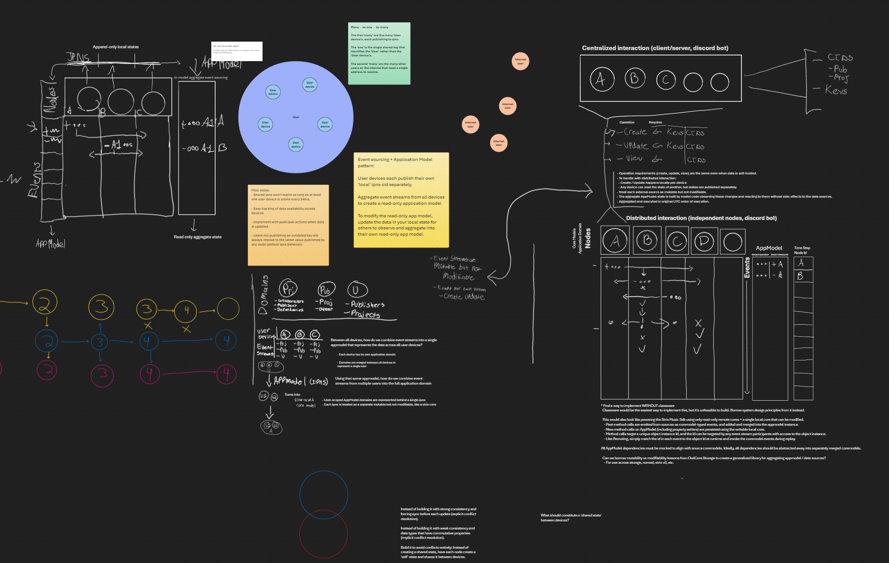

# OwlCore.Nomad.Kubo [](https://www.nuget.org/packages/OwlCore.Nomad.Kubo)

Shared tooling for building Nomad-enabled applications on ipfs.

Nomad enables applications to distribute their application domain across a set of peers. It does this by having each one maintain their own modifiable event stream while reading the read-only event streams published by other peers. 

Put simply, this library was built to cover the gap between "User device" and "User" with eventual consistency.

In Nomad, the state of an object is rebuilt from a seed by replaying the member calls present in one or more event stream sources, always in the UTC order of execution. Even as peers come and go, no CDRTs or special conflict resolution logic is required. Conflict resolution is effectively delegated to an implementation detail. 

This library was specially crafted to take advantage of content addressing under a changing device topology, especially considering the broadcast-only nature of IPNS, the immutability of IPFS CIDs, and the need to create a "shared" p2p-native state while still reaching eventually consistency on the resulting data.

## Featuring:
- Interfaces and models for building Nomad applications using Ipfs/Kubo.
- `IKuboOptions` for piping basic preferences for pinning, ipns lifetime, and caching through your application.
- Read-only and modifiable Kubo-based event stream handler interfaces.
- A base implementation `ReadOnlyNomadKuboEventStreamHandler` that handles advancing the handler's event stream using resolved data from ipfs. Just implement `ApplyEntryUpdateAsync` in the derived class.
- Models and tooling to handle local vs roaming ipns keys. The roaming key is used to publish a fully advanced, fully consolidated model from an event stream handler to ipns. If all peers have the same data, they will all publish the same CID to ipns.
- Helpers for appending and publishing a new event stream entry to a local ipns key in Kubo.
- Helpers for publishing the fully advanced roaming object to ipns (alongside sources).

This library is in prerelease and documentation is a work-in-progress. Reach out if you'd like to use this library in your own application.



## Install

Published releases are available on [NuGet](https://www.nuget.org/packages/OwlCore.Nomad.Kubo). To install, run the following command in the [Package Manager Console](https://docs.nuget.org/docs/start-here/using-the-package-manager-console).

    PM> Install-Package OwlCore.Nomad.Kubo
    
Or using [dotnet](https://docs.microsoft.com/en-us/dotnet/core/tools/dotnet)

    > dotnet add package OwlCore.Nomad.Kubo

## Usage

```cs
var test = new Thing();
```

## Financing

We accept donations [here](https://github.com/sponsors/Arlodotexe) and [here](https://www.patreon.com/arlodotexe), and we do not have any active bug bounties.

## Versioning

Version numbering follows the Semantic versioning approach. However, if the major version is `0`, the code is considered alpha and breaking changes may occur as a minor update.

## License

All OwlCore code is licensed under the MIT License. OwlCore is licensed under the MIT License. See the [LICENSE](./src/LICENSE.txt) file for more details.
